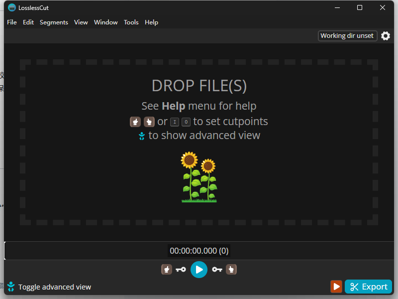

一款免费开源的无损音视频剪切工具，能够快速裁剪音视频并保持无损质量而无需重新编码。目前支持Win 、Mac以及Linux三大平台。

## 安装

从以下地址获取：

[LosslessCut（Win + Mac +Linux）](https://pan.quark.cn/s/319077b2c024)

因为是免安装版，只要解压压缩包后双击`LosslessCut.exe`运行就可以了，不需要按装。

## 支持格式：

视频格式：MP4、MOV、WebM、Matroska、OGG 和 WAV。
音频编解码器格式：FLAC、MP3、Opus、PCM、Vorbis 和 AAC。
视频编解码器格式：H264、AV1、Theora、VP8、VP9 和 H265（需要硬件解码器）。

## 使用

### 界面语言切换为中文

刚进入界面时，是英文版的需要转换一下：

选择file -> setting

在App language 中选择下拉选项，选择简体中文，不用重启，马上就变为中文了。

变为中文后，会发现里面有很多功能，按自己喜欢的功能设置就行

回到主界面，可以在左下角选择高级视图，然后导入个视频看看效果：

## 软件特点：

- 支持多种视频和音频格式，允许重新排列片段、合并文件、添加/删除/替换音轨、提取轨道、快速编辑多个文件、编辑元数据、拍摄快照、导出帧等
- 可进行各种其他操作：如时间码偏移、旋转/方向调整、字幕查看、章节标记编辑、黑场/静音检测、场景变化检测、变速等。
- 提供键盘快捷键、时间轴缩放、视频缩略图、音频波形、撤销/重做功能，并可查看 FFmpeg 命令日志。
- 支持多数格式的无损剪切
- 实验性质功能：自动检测静默段（例如电视广告）
- 重排任意顺序下的音视频段落
- 流编辑处理
- 将多个源组合到一个输出里 （比如给一个视频加上背景音乐）
- 提取、编辑和移除各种类型轨道 (包括但不限于视频/音频/字幕/附件)
- 快速批次流程 （注意：尚未有批量输出）
- 无损重编码视频/音频到不同格式的文件中
- 可以从视频中提取全分辨率快照，保存为 JPEG/PNG 格式（低或高质量）
- 将一段时间范围内的帧导出为图像 (每n个帧、秒数、场景变化等)