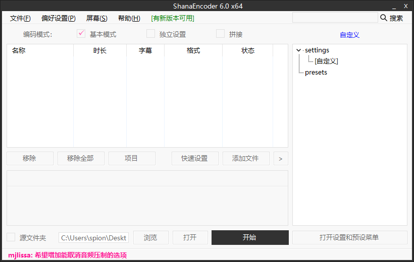
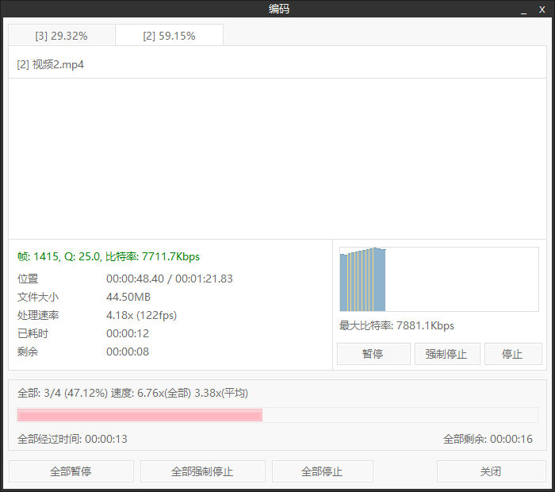
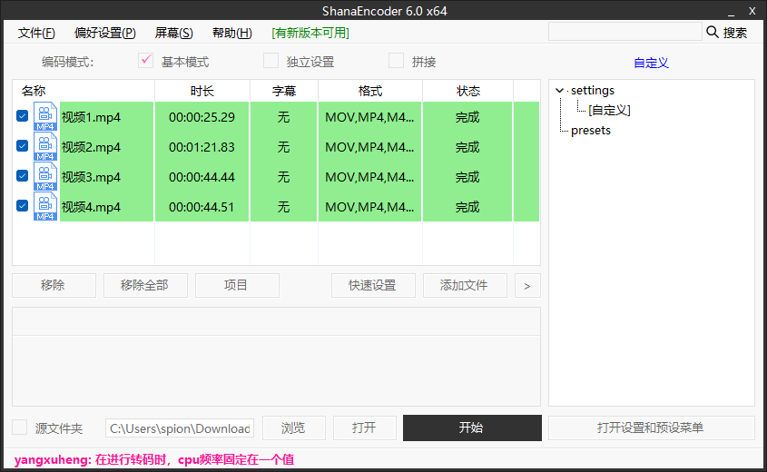
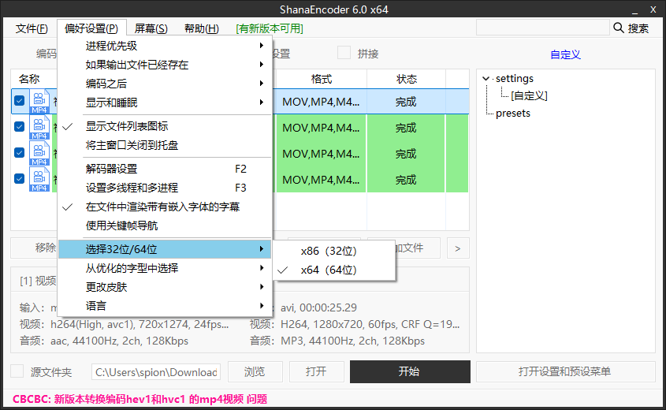

## 介绍

ShanaEncoder是一款基于FFmpeg开发的音频/视频编码程序，具有图形界面友好、操作便捷的特点，支持多核CPU加速和快速批量视频转换。该软件提供RMVB转MP4、AVI转MPEG等数十种格式转换功能，并支持字幕叠加、裁剪、H.264（High 10）编解码等专业处理。其免费开源特性及多语言界面设计，既适合初学者快速上手，也能满足专业人士的编码需求

## 安装

[ShanaEncoder6.0.1.7免安装版](https://pan.quark.cn/s/423ed90a3f16)

## 软件特性：

1. 快速的编码速度和专业的质量，支持分辨率修改及输出格式选取。
2. 提供隐藏式字幕、字幕叠加、徽标、裁剪、片段等多种设置功能。
3. 支持 GPU加速和H.264(High 10) 解码/编码。
4. 支持unicode。
5. 多线程添加文件以及分割裁剪视频。

## 使用

点击开始，或导入 视频，可以将视频添加进来

压缩时间比较短，可以看到我是批量压缩的：

可以进行一些偏好设置：

## 解码器选择功能：

从此版本开始，可在菜单栏“偏好设置”->“解码器设置”（快捷键 F2）中根据原始视频的编解码器设置硬件解码器。亦可以根据系统性能自动设置优化的解码器，并且在部分硬件解码器中预览时可以进行硬件加速播放。

该版本提供解码器设置窗口分别有：

- SW(FFmpeg)：软件（FFmpeg 内置编解码器）
- 解码HW(AUTO)：软件查找系统中可用的硬件解码器，并自动选择最佳硬件解码器
- HW(DXVA2)：强制 DXVA2 硬件解码器
- HW(D3D11VA)：强制D3D11VA 硬件解码器
- HW(NVDEC) : 强制 NVDEC 硬件解码器
- HW(QSV) : 强制 QSV 硬件解码器

多线程功能：添加文件时可以同时添加多个文件，添加文件时使用的线程数与线程数相同。线程数可设置在 0（自动）和 128 之间。将其设置为0 会将其设置为匹配当前系统上的线程数。

## 使用说明

## 核心功能

尤其是对B站视频上传机制十分友好。支持win7-11

**格式转换**：支持RMVB、MP4、3GP、AVI、MPEG、MTS、DVD、F4V等主流格式互转

**专业处理**：
- 字幕功能：封闭式字幕、字幕叠加
- 画面调整：视频裁剪、分段处理、画面比例修改
- 编码技术：支持H.264（High 10）解码/编码，提升视频压缩效率

## 技术特性

- 硬件加速：支持多核CPU加速，提升批量转换速度
- 批量处理：支持拖拽文件批量导入，自动队列化处理
- 兼容性：采用Unicode编码标准，支持多语言文件路径