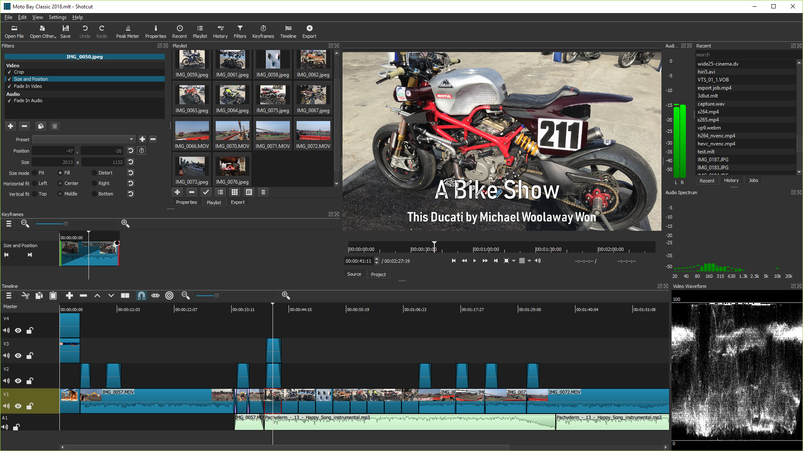

Shotcut跨平台支持Windows、Mac、Linux和Android；支持4K、8K视频处理，可进行帧精确搜索和视频合成，有丰富的滤镜和特效；音频编辑功能强大，配备示波器和多种滤波器，支持淡入淡出等过渡效果；无需导入即可直接在时间线上编辑，支持HTTP、HLS等多种网络流协议。

## 安装

从以下地址获取：

[Shotcut开源免费版](https://pan.quark.cn/s/319077b2c024)

主界面

## 格式支持

- 借助FFmpeg支持最新的音频和视频格式
- 支持流行的图像格式，如 AVIF、BMP、GIF、JPEG、PNG、SVG、TIFF、WebP 以及图像序列
- Lottie、rawr、Rive 和 After Effects 动画
- 创建、导入、编辑、导出、渲染和嵌入字幕
- 导入字幕格式 SRT、VTT、ASS 和 SSA
- 无需导入 - 原生时间线编辑
- 多种格式的帧精确搜索
- 多格式时间线：在项目中混合和匹配分辨率和帧速率
- 网络摄像头捕捉
- 音频捕捉
- 支持 4K 和 8K 分辨率
- 网络流播放（HTTP、HLS、RTMP、RTSP、MMS、UDP）
- Frei0r视频生成器插件（例如彩条和等离子）
- 颜色、文本、噪声和计数器生成器
- EDL（CMX3600 编辑决策列表）导出
- 将单帧导出为图像或将视频导出为图像序列
- 带有 Alpha 通道的视频文件 - 可读写
- 将 HDR 色调映射到 SDR
- 可选的全范围视频输入、处理和导出
- 仅使用 GPU 效果时端到端 10 位视频
- 批量转换

## 音频功能

- 音频示波器：响度计、峰值计、波形、频谱分析仪、环绕声、矢量
- 音量控制
- 音频滤波器：
- Ambisonic 解码器、Ambisonic 编码器、平衡、带通、压缩器、复制通道、去咔嗒声、延迟、缩混、均衡器：3 波段、均衡器：15 波段、均衡器：参数、扩展器、增益、高通、反转、限制器、低通、中侧矩阵、噪声门、标准化：一次通过、标准化：两次通过、陷波、平移、音高、混响、立体声增强器、交换通道、音轨自动淡入淡出、音轨接缝
- 所有音轨的音频混合
- 使用时间线上易于使用的推子控件淡入淡出音频并淡出视频至黑色
- 通过在时间轴的同一轨道上重叠镜头，交叉淡入淡出音频和视频可以轻松溶解过渡
- JACK 传输同步
- 音调发生器
- 立体声、单声道、5.1 环绕声、四声道环绕声和 Ambisonic 空间音频配置
- 视频速度变化的音调补偿
- 例如，直接录制到时间线以进行画外音
- 将口语转换为字幕文本

## 视频效果

- 跨视频轨道的视频合成
- 用于色彩校正和分级的 3 向（阴影、中间色、高光）色轮
- 使用吸管工具选择中性色进行白平衡
- 去隔行
- 自动旋转，手动控制
- 使用时间线上易于使用的淡入/淡出音频和淡入淡出视频的淡入/淡出效果
- 视频擦除过渡：
- 条形、谷仓门、盒子、时钟（径向）、对角线、虹膜、矩阵和自定义渐变图像
- 轨道合成/混合模式：
- 无、覆盖、添加、饱和、乘法、屏幕、叠加、变暗、减淡、加深、强光、柔光、差异、排除、HSL 色相、HSL 饱和度、HSL 颜色、HSL 亮度。
- 视频滤镜：
 - Alpha 通道：调整、Alpha 通道：视图、Alpha 频闪、音频舞蹈可视化、音频电平可视化、音频光可视化、音频频谱可视化、音频波形可视化、混合模式、模糊：框、模糊：指数、模糊：高斯、模糊：低通、模糊：垫、亮度、断断续续、色度保持、色度键：高级、色度键：简单、对比度、颜色分级、角钉、裁剪：来源、裁剪：圆形、裁剪：矩形、去带、扭曲、抖动、阴影、弹性缩放、翻转、鱼眼、故障、发光、GPS 图形、GPS 文本、渐变、渐变图、网格、半色调、HSL 原色、HSL 范围、色相/亮度/饱和度、反转颜色、键溢出：高级、键溢出：简单、镜头校正、色阶、3D LUT、蒙版：应用、蒙版：色度键、蒙版：来自文件、蒙版：简单形状、镜像、马赛克、运动跟踪器、紧张、无同步、噪音：快速、噪音：关键帧、老电影：灰尘、老电影：颗粒、老电影：投影仪、老电影：划痕、老电影：特艺色彩、不透明度、色调分离、降低噪音：HQ3DN、降低噪音：量化、降低噪音：智能模糊、降低噪音：小波、反射、RGB 偏移、旋转和缩放、饱和度、扫描线、棕褐色调、锐化、大小和位置、素描、速度：仅前进、速度：前进和后退、污点去除、稳定、字幕烧入、文本：丰富、文本：简单、阈值、时间重映射、计时器、跟踪自动淡入淡出视频、轨迹、眩晕、活力、晕影、取消预乘 Alpha、波浪、白平衡
- 360° 视频滤镜：
  - 等距矩形蒙版、360：等距矩形到直线、360：等距矩形到立体、360：半球到等距矩形、360：直线到等距矩形、360：稳定、360：变换
- 音频/视频剪辑的速度提升
- 反转剪辑
- 定格
- 视频示波器：直方图、RGB 分量、RGB 波形、波形、矢量示波器和缩放
- 物体运动追踪

## 编辑功能

- 使用波纹选项在源剪辑播放器或时间线上进行修剪
- 易于使用的剪切、复制和粘贴操作
- 在时间线上附加、插入、覆盖、提升和波纹删除编辑
- 三点编辑
- 隐藏、静音和锁定轨道控制
- 带有缩略图和波形的多轨时间线
- 撤消和重做
- 创建、播放、编辑、保存、加载和导出（渲染）MLT XML 项目（自动保存）
- 将修剪后的剪辑保存并加载为 MLT XML 文件
- 加载并播放复杂的 MLT XML 文件作为剪辑
- 从文件管理器拖放文件
- 洗涤和运输控制
- 滤波器参数的关键帧
- 关键帧的缓动函数
- 从视频片段中分离音频
- 大多数过滤器和导出的预设 - 包括提供的和用户创建的
- 类似媒体播放器的播放列表，也可用作剪辑箱
- 播放列表视图中用于组织媒体的自定义和智能文件夹（文件夹）
- 按名称或创建/录制日期对播放列表进行排序
- 搜索播放列表
- 按视频、音频、图像或其他方式过滤播放列表
- 将文件从文件管理器拖放到播放列表
- 从播放列表批量导出
- 从播放列表中的剪辑生成幻灯片或蒙太奇
- 查看播放列表的详细信息、缩略图或两者
- 在播放列表和时间线中多选项目
- 在时间线上对剪辑进行分组
- 在时间线上移动和轻推剪辑和组
- 在时间线上拆分并重新合并剪辑
- 根据音频对齐或同步剪辑
- 为剪辑创建自定义名称并输入有关它的评论
- 低分辨率代理编辑可提高搜索速度并消除或最小化缩放
- 时间线标记和范围，包括从范围导出和导出为文本章节
- 注释面板用于记录项目注释或包含用于画外音阅读的文本
- 灵活插入和重新排序曲目
- 使用矢量动画工具（包含在我们的 Shotcut 下载中）编辑 Lottie 和 rawr JSON 动画
- 可配置的时间格式：SMPTE 时间码、时间时钟或帧数
- 带有自定义缩略图的集成文件系统浏览器
- 在文件视图中搜索当前文件夹
- 按视频、音频、图像或其他方式过滤文件视图