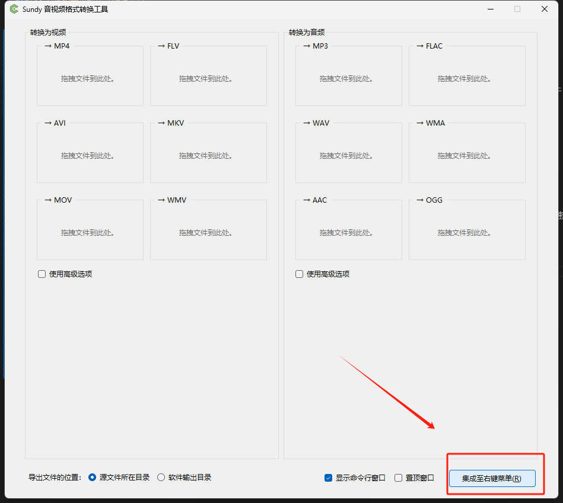
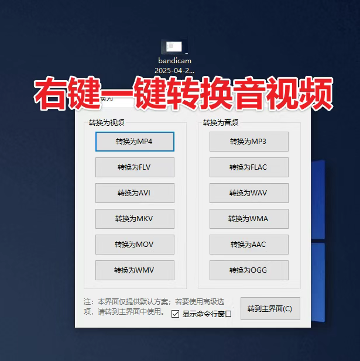

Sundy音视频格式转换工具支持多种常见音视频格式间的相互转换，使用时只需将需要转换的文件拖拽到对应格式，软件即可自动完成格式转换，对于需要频繁转换文件格式的人群，软件右下角提供了集成至右键菜单功能，可有效提升工作效率。

## 安装

[Sundy音视频格式转换工具](https://pan.quark.cn/s/2cf473127d74)

它不止是可以转换音频，视频常见格式也可以转换

Sundy音视频格式转换工具是一款基于ffmpeg的便携式格式转换工具，适用于Windows 7及以上系统。它操作简单，支持拖拽文件转换和右键菜单快速转换，能够处理常见的音视频格式。虽然功能相对基础，但对于日常格式转换需求来说已经足够高效便捷。居然支持win7，虽然说用户不多，但是也算是给win7用户一点希望了！

软件特点便携式设计：无需复杂安装，解压缩即可使用。

拖拽转换：支持拖拽文件到主窗口进行快速转换。右键菜单集成：集成至右键菜单，方便快速调用转换功能。

常见格式支持：支持多种常见的音视频格式转换。基于ffmpeg：利用ffmpeg的强大功能，确保转换的稳定性和效率。

开源协议：采用LGPL开源协议，用户可自由使用和修改。真的使用非常简单，支持音视频一键格式转换，拖动进来即可，支持硬件加速，而且还可以集成到右键上！

Sundy音视频格式转换工具是处理音视频格式问题的得力助手。下面我从工具概况入手，详细介绍其功能，并通过分步演示，说明它的使用方法。

# Sundy音视频格式转换工具：高效转换，轻松驾驭多媒体文件

在数字化信息飞速发展的今天，音视频文件已成为人们生活与工作中不可或缺的内容载体。然而，不同设备、软件对音视频格式的要求各不相同，格式不兼容问题常常令人头疼。Sundy音视频格式转换工具应运而生，以强大的功能和简洁的操作流程，为用户提供了一站式音视频格式转换解决方案，轻松打破格式壁垒。

## 功能

### 1. 广泛的格式支持
Sundy音视频格式转换工具支持市面上几乎所有主流的音视频格式，涵盖视频格式如MP4、AVI、MKV、WMV、FLV等，音频格式如MP3、WAV、AAC、FLAC、AIFF等。无论是想要将手机拍摄的MOV格式视频转换为电脑剪辑软件通用的MP4格式，还是把无损音乐FLAC格式转换为便于在车载设备播放的MP3格式，Sundy都能完美胜任。同时，它还支持一些特殊格式的转换，满足专业用户的多样化需求。

### 2. 高质量转换输出
在格式转换过程中，Sundy工具采用先进的编码技术，最大限度保留原始文件的画质和音质。即使是高清视频或高保真音频文件，经过转换后，画面依然清晰流畅，色彩鲜艳，音频的细节和层次感也不会丢失。此外，用户还可以根据自身需求，对输出文件的分辨率、码率、帧率、声道等参数进行个性化调整，实现精准的高质量输出。

### 3. 批量转换，高效省时
如果用户有大量音视频文件需要转换格式，Sundy工具的批量转换功能就能大显身手。只需将多个文件一次性导入转换列表，设置好目标格式和输出参数，点击开始转换，工具便会自动按序处理所有文件，无需手动逐个操作。这一功能极大提高了工作效率，尤其适用于影视制作、教育培训等需要处理大量多媒体文件的场景。

### 4. 简单的剪辑与合并
除了格式转换，Sundy工具还具备基础的音视频剪辑和合并功能。用户可以轻松裁剪视频片段，去除不需要的部分；也能对音频文件进行剪辑，提取出自己喜欢的音乐段落。此外，将多个音视频文件合并为一个文件的操作同样简单便捷，方便用户制作完整的作品集或连续的视频内容。

### 5. 跨平台支持
Sundy音视频格式转换工具支持在Windows、Mac等主流操作系统上使用，无论是PC用户还是苹果用户，都能轻松安装并使用。同时，它还提供移动端APP版本，方便用户在手机和平板上随时随地进行格式转换操作，真正实现跨平台无缝衔接。
