不管是什么视频编辑软件，只要运用得当加以熟悉，都能玩得很厉害。

万兴神剪手合适想要录屏的画手、简单的剪辑和片头特效，因为界面非常友好（和会声会影相似），可以作为初入剪辑者的最佳选择。（比免费剪辑软件更便利，价格也非常非常非常亲民！）

注意：已经是免费绿色版，所以不存在有水印之类的问题了。

## 安装

从以下地址获取：

[万兴神剪手免费绿色版下载](https://pan.quark.cn/s/319077b2c024)

共两款，一款是安装版，双击安装，基本就是下一步下一步实现；

另一款，解压缩后先点击`!)绿化处理.bat`，然后双击`Wondershare Filmora X.exe`运行就可以了，不需要按装。

打开后的界面如下所示：

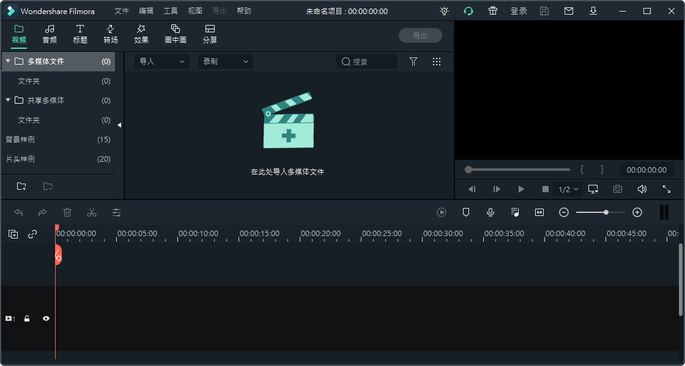

导入视频后的效果

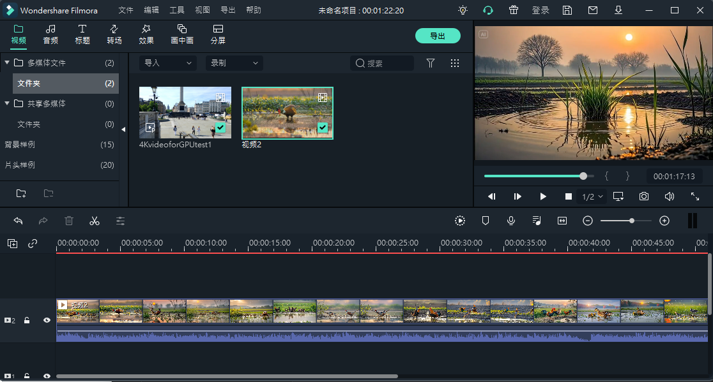

## 使用

万兴神剪手主要的特点是：操作简单，易上手，小白式一键剪辑，专业化高级创作。除了提供多种基础剪辑功能外，还具备画中画，位移，转场，倒播，无极变速等高级编辑功能呢，让我3分钟就能轻松创作一部大片。

下面一些常见效果：

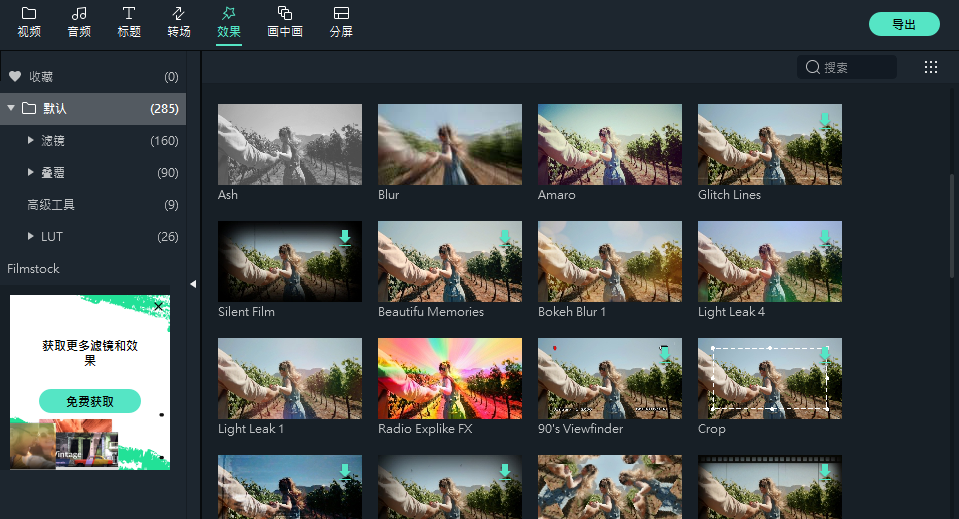

 叠覆

 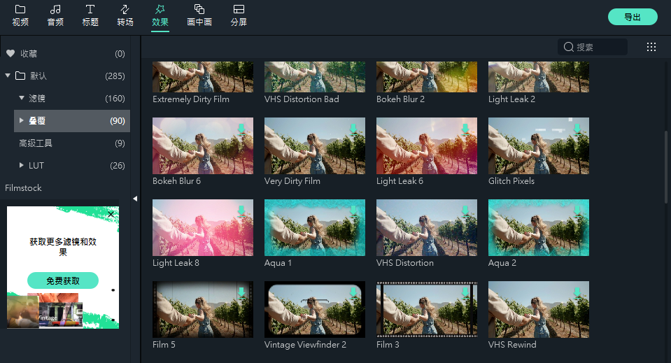

 画中画

 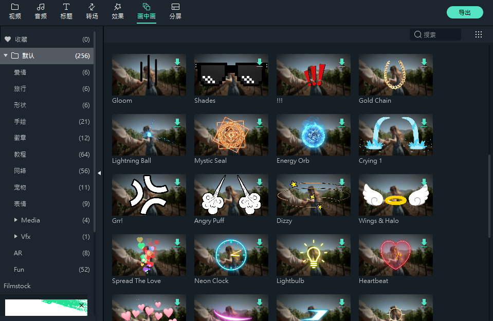

 分屏

 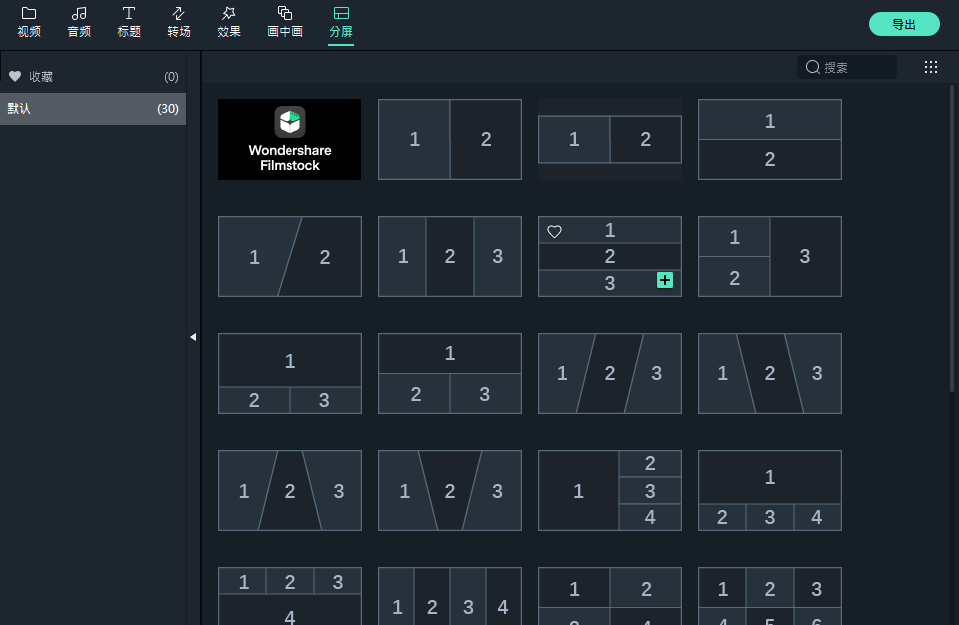

 转场

 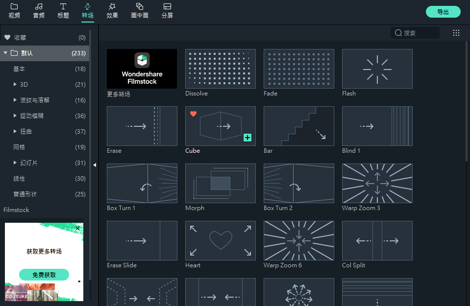

 文字标题

 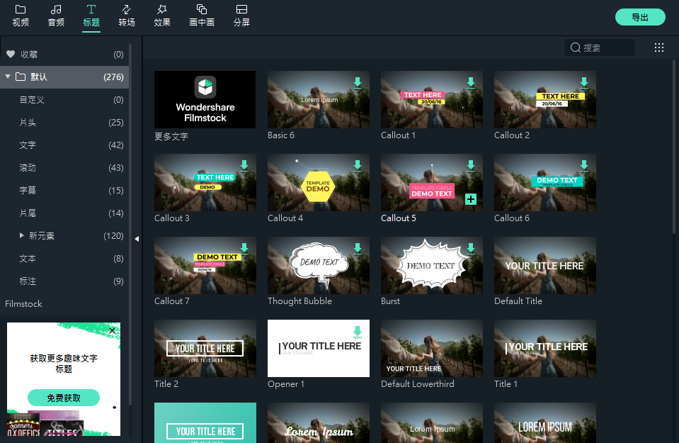

 音频

 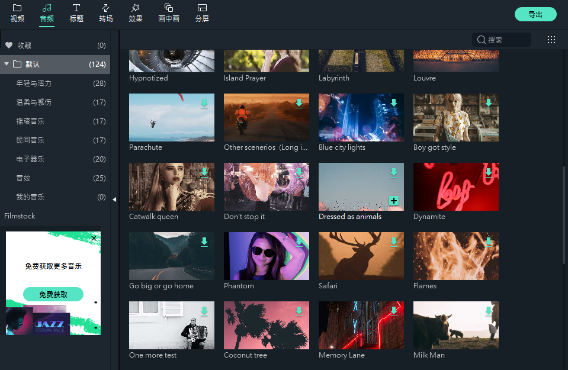

 转场

 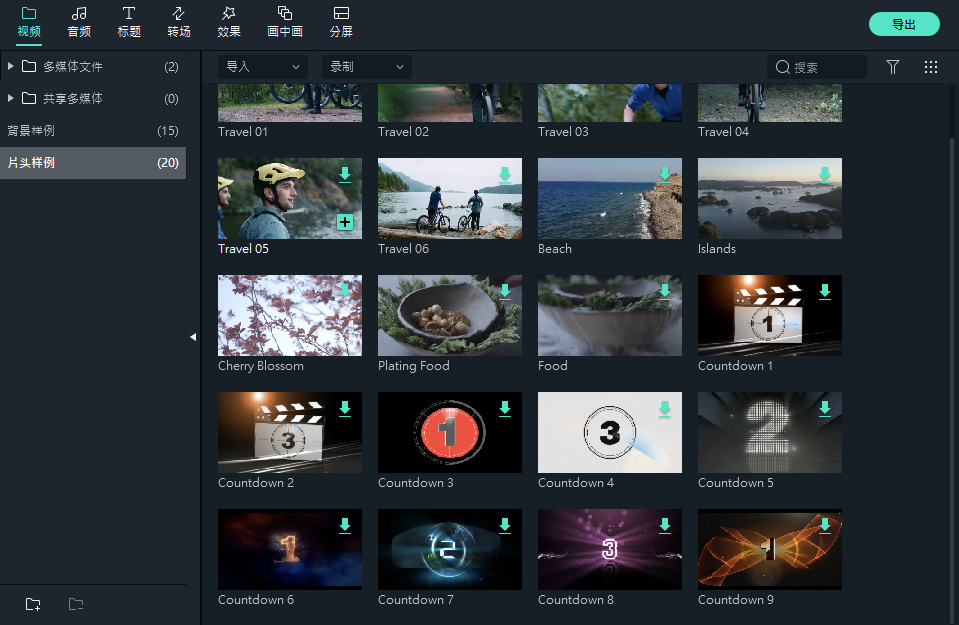

 工具

 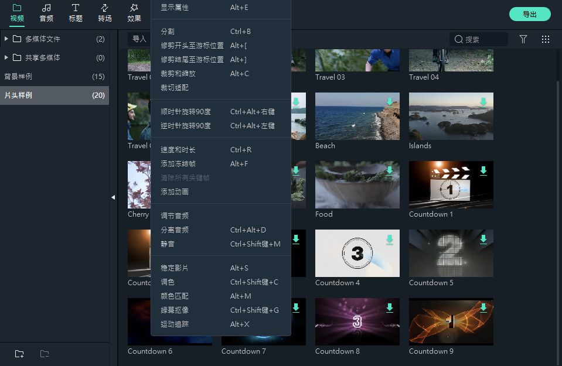