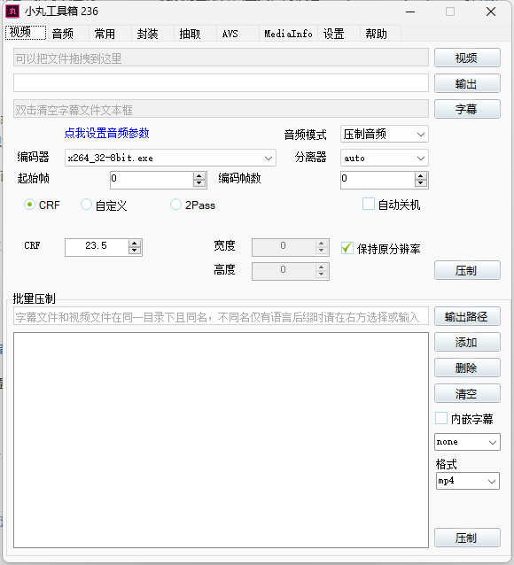
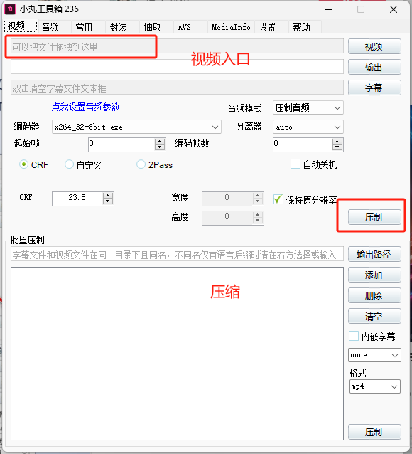
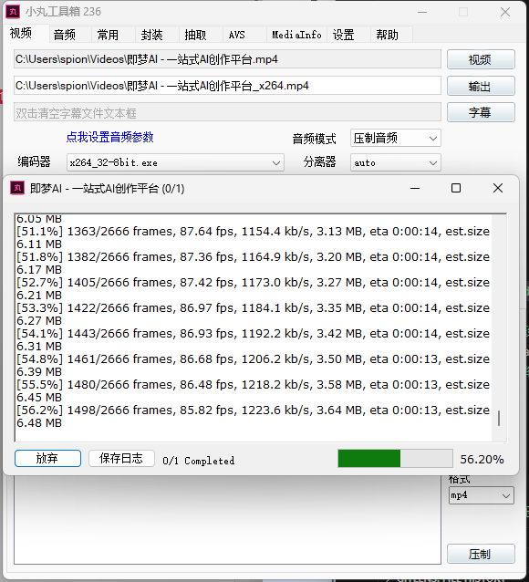
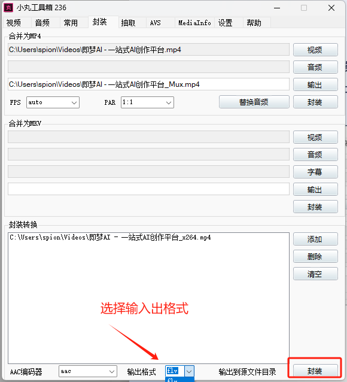
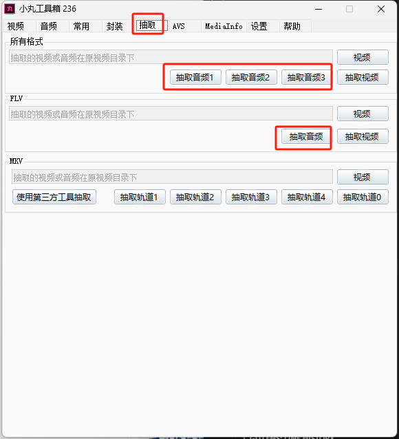
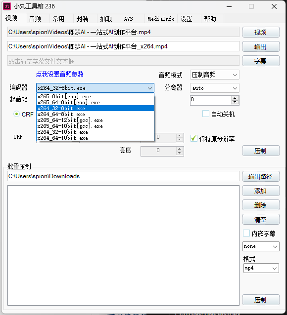

分辨率、码率、帧数等等，这些都是视频的参数，视频在压制过程中还有很多参数的

那些小组和大神都是自己写参数，小丸这些工具就是把这些参数做到尽可能的平衡和最优

我曾经用格式工厂和小丸用相同参数压制，效果一眼见高低

不信你可以自己压了比一下

## 一、工具介绍

小丸工具箱一款可以压制H264+AAC视频的图形界面工具，内核是x264、neroaac、mp4box等软件。预制了@zj262144 研究出来的高清高压参数。

x264.exe是06_taro编译的x264_32_tMod-8bit-420.exe，软件已经附带x264_32_tMod-10bit-420.exe。用户可自行替换为10bit版本，其他版本请点击06_taro编译版。注意：XP系统需要安装Microsoft.NET Framework 2.0小丸工具箱(视频图形界面压制器)是一款可以压制H264+AAC视频的图形界面工具，内核是x264、neroaac、mp4box等开源软件，属于傻瓜型压制工具。

## 二、安装步骤

### （一）下载软件

[小丸工具箱绿色免安装版视频压缩](https://pan.quark.cn/s/423ed90a3f16)

### （二）安装过程

安装和所有软件一样，基本就是下一步下一步，直到安装完成。

但是，如果使用绿色版，双击就可以运行了。看你选择怎么安装。

以下是打开后的界面：

## 三、核心功能

### （一）强大的编码压缩
小丸视频压缩工具集成了x264和x265编码技术。x264编码是目前应用广泛的视频编码标准，能在中等码率下提供出色的画质；x265编码则在x264的基础上，进一步提升了压缩效率，在相同画质下，文件体积可压缩得更小。通过选择合适的编码方式和参数，用户可以灵活控制视频的压缩比和画质表现 。

### （二）多格式兼容
该工具支持多种常见视频格式的压缩处理，包括MP4、MKV、AVI等。无论是手机拍摄的视频、网络下载的视频，还是专业设备录制的视频文件，都能导入小丸视频压缩工具进行处理，兼容性强，满足不同用户的需求。

### （三）音频处理
小丸视频压缩工具不仅可以对视频进行压缩编码，还能对音频进行处理。它采用AAC音频编码，能有效降低音频文件大小，同时保持良好的音质。用户可以调整音频的采样率、码率等参数，实现对视频音频部分的精细化处理 。

### （四）批量处理
当用户需要处理多个视频文件时，小丸视频压缩工具的批量处理功能十分实用。用户只需将多个视频文件添加到任务列表中，统一设置好压缩参数，即可一次性对多个视频进行压制，大大提高工作效率，节省大量时间和精力。

### （五）参数自定义
对于有一定视频处理经验的用户，小丸视频压缩工具提供了丰富的参数自定义选项。用户可以手动设置分辨率、帧率、码率控制模式、CRF（恒定码率因子）等参数，根据不同的视频内容和使用场景，精准控制视频的最终效果，实现个性化的视频压缩需求 。

## 四、使用方法

### （一）导入视频

1. 打开小丸工具箱软件，进入主界面。选择导入视频或拖拽视频到下图区域中，导入后选择压缩，见下图：

视频压缩中，可以看到一些看不懂的代码，不用理会，我也看不懂。

2. 封装转换：可将其它视频格式如MKV/FLV/F4V转换成MP4。

打开小丸工具主界面，然后选择封装，

3. 还可以抽取音频，音频中有多个音乐都可以抽取。

### （二）设置压缩参数
1. **编码方式选择**：在“视频流”区域的“编码器”下拉菜单中，选择x264或x265编码。若追求更高的压缩比，可选择x265；若注重兼容性和相对快速的处理速度，x264是不错的选择。

2. **码率和CRF设置**：码率控制模式可选择“平均码率”“恒定码率因子（CRF）”等。选择“平均码率”时，需手动输入视频的目标码率；选择“CRF”模式，可通过调节CRF值来控制画质，CRF值越低，画质越好，文件越大，一般取值在18 - 28之间较为合适，可根据实际需求调整。

3. **分辨率和帧率调整**：在“视频流”区域找到“分辨率”和“帧率”选项，可手动输入数值或通过下拉菜单选择合适的参数，以满足不同的视频播放需求。

4. **音频设置**：在“音频流”区域，选择合适的音频编码器（通常为AAC），并可调整音频码率、采样率等参数，设置完成后，确保“保留音频流”选项已勾选。
5. **输出格式和路径设置**：在“输出”区域，点击“输出路径”后的“浏览”按钮，选择压缩后视频文件的保存位置；在“输出格式”下拉菜单中，选择MP4、MKV等想要的输出格式 。

### （三）开始压缩
完成视频导入和参数设置后，点击软件界面下方的“压制”按钮，小丸视频压缩工具将开始对视频进行压缩处理。在压制过程中，界面会显示进度条、处理速度、剩余时间等信息，方便用户了解任务进度。

### （四）查看与导出
1. 视频压制完成后，软件界面会提示压制完成。此时，可在输出路径文件夹中找到压缩后的视频文件，双击打开进行查看，检查视频的画质、声音等是否符合预期。
2. 若对压缩效果不满意，可返回软件界面，调整相应的压缩参数，重新进行压制，直至获得满意的视频效果。 
