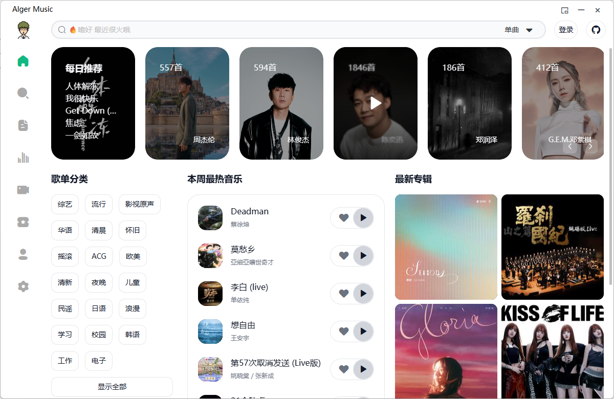

## 应用下载安装

目前提供安卓、web、windows（win10以上）、macos、linux等下载、ios需要等

[两款及所有版本都在这里了](https://pan.quark.cn/s/b8fc27690859)

## AlgerMusicPlayer

一个第三方音乐播放器，支持本地服务、桌面歌词、主题切换，目前来说算是最好的工具了

苹果，安卓，网页版，windows桌面端均可使用

 
### window卓面

下载比较简单，点击右键下载

搜索下载

推荐

排行版

地区

收藏和历史

常用的一些设置，改颜色主题之类的

### 手机端

苹果，安卓版本都有，获取地址在上面

点击每日推荐，您可以浏览到好音乐

任意点开想听的歌即可播放使用

搜索

## AlgerMusicPlayer 功能亮点

### **🎵 音乐推荐**

### **🔐 网易云账号登录与同步**

### **📝 功能**
    - 播放历史记录
    - 歌曲收藏管理
    - 歌单 MV 排行榜 每日推荐
    - 自定义快捷键配置（全局或应用内）

### **🎨 界面与交互**
    - 沉浸式歌词显示（点击左下角封面进入）
    - 独立桌面歌词窗口
    - 明暗主题切换
    - 迷你模式
    - 状态栏控制
    - 多语言支持

### **🎼 音乐功能**
    - 支持歌单、MV、专辑等完整音乐服务
    - 灰色音乐资源解析（基于 @unblockneteasemusic/server）
    - 音乐单独解析
    - EQ均衡器
    - 定时播放 远程控制播放 倍速播放
    - 高品质音乐
    - 音乐文件下载（支持右键下载和批量下载, 附带歌词封面等信息）
    - 搜索 MV 音乐 专辑 歌单 bilibili
    - 音乐单独选择音源解析
  
### 软件特色

1、本地化服务，无需依赖在线 API，减少网络延迟，提升用户体验。

2、全平台适配，支持 Desktop、Web 和 Mobile Web，满足不同设备的需求。

3、开源技术栈，采用先进的前端技术栈，确保软件性能和稳定性。

4、丰富的自定义选项，从快捷键到主题颜色，用户可以完全按照自己的喜好进行设置。

### 软件亮点

1、歌曲下载内置封面歌词歌曲信息，添加无限制下载功能，优化下载页面添加下载记录清除功能。

2、添加搜索功能至歌曲列表，支持名称、歌手、专辑搜索，支持拼音匹配。

3、添加快捷键管理功能，支持全局和应用内快捷键的启用/禁用。

4、优化歌单加载、播放逻辑，提升大型歌单加载性能。

5、添加直接播放首页歌单功能。

6、添加统计服务。

7、优化历史和收藏视图的加载体验。

9、优化歌词界面配置，提供更好的用户体验。
 

### 常见问题

- 桌面端白屏，可能是端口被占用 在设置页面重新改一个复杂一点的端口号保证不被占用
- 安卓白屏，不支持安卓版本或服务器暂时挂掉了
- 更新问题 安卓更新手动下载，桌面端会提示更新，网页端不需要更新会实时更新
- 歌曲下载问题，安卓和网页端暂不支持下载歌曲，桌面端在歌曲右键或者在收藏列表批量下载
- 快捷键问题，快捷键可在设置页面启用和配置，支持应用内和全局快捷键
- 暂不支持本地音乐播放功能
- 歌曲音质问题，目前音质选择需要网易云VIP登录，如果没有VIP收听高音质可手动选择GDMusic解析尝试，大部分歌曲有高音质
- 如果存在歌曲与实际播放歌曲不一致情况需要手动选择其他音源重新解析

## 二、LX Music 

一个基于 electron 的音乐软件 ,洛雪音乐音源在线导入2025可用源大全专为安卓用户打造免费听歌软件，它可以帮助大家快速搜索各个平台的音乐曲目，点击就能播放，音质超棒、加载速度也很快，而且提供了多个不同的排行榜单，可以带你发现更多好听的歌曲，平时喜欢听歌的小伙伴一定不能错过哦！

同时也有桌面版

### **所用技术栈**：

    - Electron 30+
    - Vue 3

### **已支持的平台：**

    - Linux
    - macOS
    - Windows 7 及以上

在设置中往下拉，找到音乐来源下面的“自定义源管理”，并点击；

然后点击“导入”；

找到上面下载的音源文件；

会提示“导入成功”，弹窗中就会出现一个“六音音源”，点击“关闭”；

然后勾选“六音音源”，后面会提示“初始化成功”，如下图所示；

最后返回首页，就可以搜索想听的歌曲了，点击就能正常播放了，比如小编测试的周杰伦的稻香，注意看截图的播放时间，是不是可以正常播放了。

