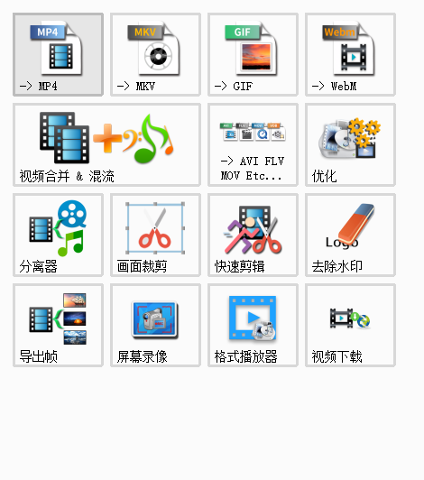
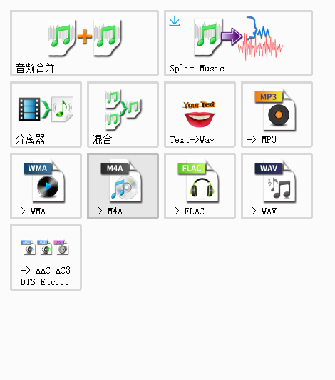
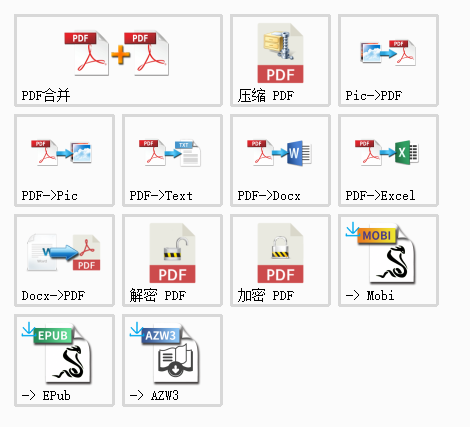
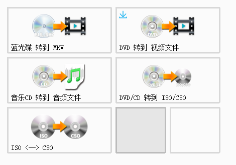
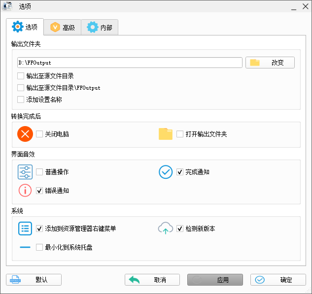
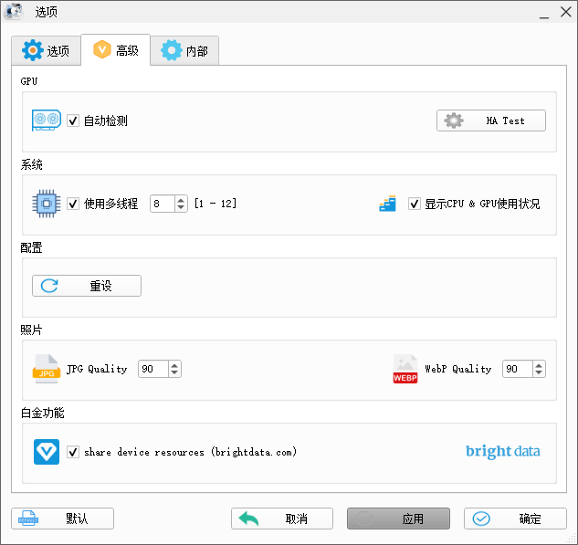
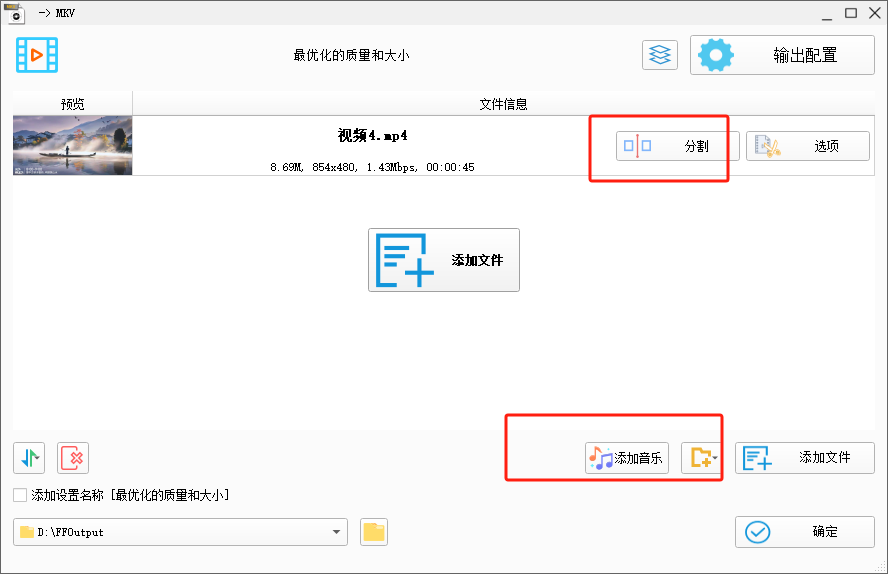

## 介绍

目前应该是最强大，使用人数最多，公认最好的工具了。

所有类型视频转到MP4、3GP、AVI、MKV、WMV、MPG、VOB、FLV、SWF、MOV、webm等，新版支持RMVB（rmvb需要安装Realplayer或相关的译码器）、xv（迅雷独有的文件格式）转换成其他格式。

所有类型音频转到MP3、WMA、FLAC、AAC、MMF、AMR、M4A、M4R、OGG、MP2、WAV等。

所有类型图片转到JPG、PNG、ICO、BMP、GIF、TIF、PCX、TGA等。

支持移动设备：索尼（Sony）PSP、苹果（Apple）iPhone&iPod、爱国者（Aigo）、爱可视（Archos）、多普达（Dopod）、歌美（Gemei）、iRiver、LG、魅族（MeiZu）、微软（Microsoft）、摩托罗拉（Motorola）、纽曼（Newsmy）、诺基亚（Nokia）、昂达（Onda）、OPPO、RIM黑莓手机、蓝魔（Ramos）、三星（Samsung）、索尼爱立信（SonyEricsson、索爱）、台电（Teclast）、艾诺（ANIOL）和移动设备兼容格式MP4、3GP、AVI。

## 安装

[格式工厂 FormatFactory 绿色免费版](https://pan.quark.cn/s/02ce8826b668)

## 支持格式转换

所有类型视频转到MP4、3GP、AVI、MKV、WMV、MPG、VOB、FLV、SWF、MOV、webm等，新版支持RMVB（rmvb需要安装Realplayer或相关的译码器）、xv（迅雷独有的文件格式）转换成其他格式。

### 视频转换

### 音频转换

### 文档转换

### 光驱转换

转换DVD到视频文件，转换音乐CD到音频文件。DVD/CD转到ISO/CSO，ISO与CSO互转源文件支持RMVB

## 常见功能

可设置文件输出配置（包括视频的屏幕大小，每秒帧数，比特率，视频编码；音频的采样率，比特率；字幕的字体与大小等）。

- 高级项中还有“视频合并”与查看“多媒体文件信息”。
- 转换过程中可修复某些损坏的视频。
- 媒体文件压缩。
- 可提供视频的裁剪。
- 转换图像档案支持缩放，旋转，数码水印等功能。
- 支持从 DVD 复制视频。
- 支持从 CD 复制音乐。

1. 支持几乎所有类型多媒体格式到常用的几种格式
2. 转换过程中可以修复某些意外损坏的视频文件
3. 多媒体文件“减肥”或“增肥”（注：看使用者的情况来“减肥”或“增肥”，大多数“增肥”后将提高视频的清晰度，帧率等，但不大推荐）
4. 支持iPhone/iPod/PSP等多媒体指定格式
5. 转换图片文件支持缩放，旋转，水印等功能
6. DVD视频抓取功能，轻松备份DVD到本地硬盘
7. 支持转换过程中可以修复某些意外损坏的视频文件
8. 支持GPU加速，编码更快

**问题：格式工厂如何使用？**

1.选择你想要转换成的格式。以要转换成“MP4”格式为例，打开软件后，选择左侧视频列表，点击“MP4”

2.添加文件/文件夹，选择输出文件夹路径，然后点击“确定”

3.点击开始

4.待转换完成后，点击输出文件夹，即可找到转好后的文件。

5.结束

**问题：格式工厂在XP上显示运行错误**

回答：请下载VC10 VC8 运行库来修复这个问题

**问题：使用“所有转到RMVB”时，总是出现“Fail to decode”的提示。**

回答：格式工厂转RMVB使用的是系统安装的解码器来解码，而格式工厂只自带几种常见的解码器，这时就需要用户自行安装这类文件的解码器，确保Windows Media Player能播放才行，你可以安装个“完美解码包”。

**问题：怎样用格式工厂制作VCD/DVD。**

回答：目前格式工厂只提供文件格式的转换，还不支持刻录，你可以先用所有转到MPG转换成一些刻录软件能识别的格式，再用他们制作。

**问题：DVD转到视频文件时出现错误。**

回答：请点击下载mencoder.rar解压后替换掉格式工厂安装目录下的FFModules目录下的 mencoder.exe
即可。

**问题：格式工厂转换好的视频是放在哪里。**

在格式工厂软件界面里有个输出文件夹，转换的文件就在里面!

**问题：格式工厂截取的视频怎么没法保存。**

格式工厂的默认保存路径为：我的文档/FFOutput。

**问题：用格式工厂把MKV转换为AVI后画面有些模糊,这是什么原因，质量我已经选最高了，是比特率和码率的问题吗。**

比特率的别名就是码率。转换的时候，若码率低于原视频，画面肯定是会变得模糊的。同时，转换格式的同时也必然会损失一些画质，所以说，为了保存视频画质，还是不要随意进行格式转换的好。若确实需要转换，可以选择转换为较好的格式，如RMVB、MP4等，都是比较先进的视频格式，编码方式好，画质保存好。另外就是转换的码率要合适。