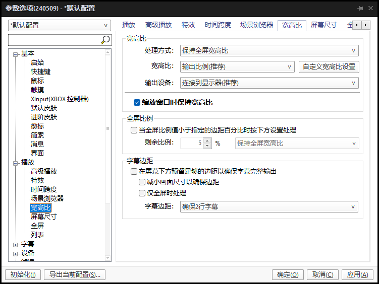
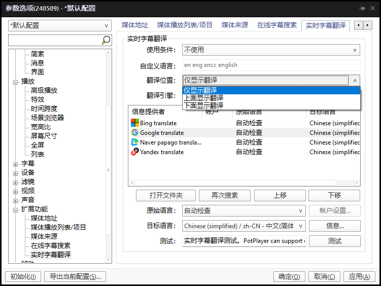

PotPlayer拥有强大的硬件加速、支持**高清影片**流畅播放支持播放**4k**、**HDR**、**蓝光原盘**、**madvr视频渲染**的功能，界面整洁、操作简单、皮肤丰富多彩，内置强大的编码器，启动速度快，播放过程稳定，对付高清大片没有任何问题，还可以各种拓展设置，对付4K毫无压力，调整视频的亮度、对比度，或者给声音加点“料”，它都给你准备好了丰富的选项，让你可以根据自己的喜好，把画面和声音调校到最舒服的状态。

## 下载地址

[PotPlayer绿色版下载](https://pan.quark.cn/s/8e12d52c5f23)

## 介绍

PotPlayer 的优势在于强大的内置解码器；而 KMPlayer 的优势在于强大的定制能力和个性化功能。PotPlayer 使用 VC++ 编写， KMPlayer 为 Delphi 编写。PotPlayer 是 Daum 公司的一款网络播放器，有自己的独立著作权，并非原创，由 KMPlayer 的原始作者进行后续开发。(1428以后版本)的 KMPlayer 由 PandoraTV 团队负责集体开发。应 PandoraTV 的要求，PotPlayer 不会加入在 KMPlayer 中一些受欢迎功能，但作者答应加入一些近似的功能。

## 软件功能

1、支持32位和64位系统。

2、内置硬件加速解码，支持MPEG1/2(IDCT/MoComp)，WMV2(MoComp)，WMV3(IDCT/MoComp)，VC-1(IDCT/MoComp/VLD)，H.264/AVC1(VLD)。

3、内置 E_AC3 音频解码。

4、网络流媒体播放支持。

5、播放H264、VC1、MPEG I \ II TS \ PS 等编码，只要使用设定内建硬解都可顺利硬解，不用其它解码器。

6、可以较完整的支持 ASS\SSA 字幕，不会发生 KMP 中字幕被截断的问题，但依然支持不完全。

## 皮肤/配色

在皮肤/配色一栏中，我们可自由选择界面皮肤

导入方式：打开PotPlayer安装文件夹——找到SKins，将我们的下载的皮肤粘贴在其中即可

或者直接在设置——皮肤/配色——选择打开皮肤文件夹，将下载的皮肤粘贴进去

## 播放

在播放一栏的设置中，有很多需要注意的地方

比如是否循环播放、记忆播放位置、播放时隐藏鼠标等

## 宽高比

在宽高比中，建议勾选缩放时保持宽高比，其余项使用推荐即可

## 实时字幕翻译

实时字幕翻译也很简单右键PotPlayer界面依次选择字幕——实时字幕翻译——使用即可

默认是谷歌翻译，你可以根据需求选择

详细设置可在选项——扩展功能——实时字幕翻译处设置

## 滤镜（画质增强）

设备一栏没有我们需要的，就直接跳过

来到滤镜一栏

你可能听说过所谓的PotPlayer高阶玩法就是添加外部滤镜madVR和LAVFilters

此时的 Potplayer, 已经接近完美，但是，偶尔会有视频格式无法播放，比如最新的编码格式 H265。

LAV Filters 视频解码器：如果有遇到不支持的视频格式，可以下载安装 Lav Fliters；如果平时没遇到的话，也可以先不折腾。
madVR 视频渲染器：很多大神都有提到的，这个是牺牲电脑 CPU 和显卡性能来换取画质提升的，设置和调教都比较复杂，耗费时间不说，很可能一顿操作猛如虎，最后发现画质还不如系统自带的电影和电视。非蓝光电影爱好者，或有特殊色彩喜好的用户外，并不推荐广大普通用户去折腾。