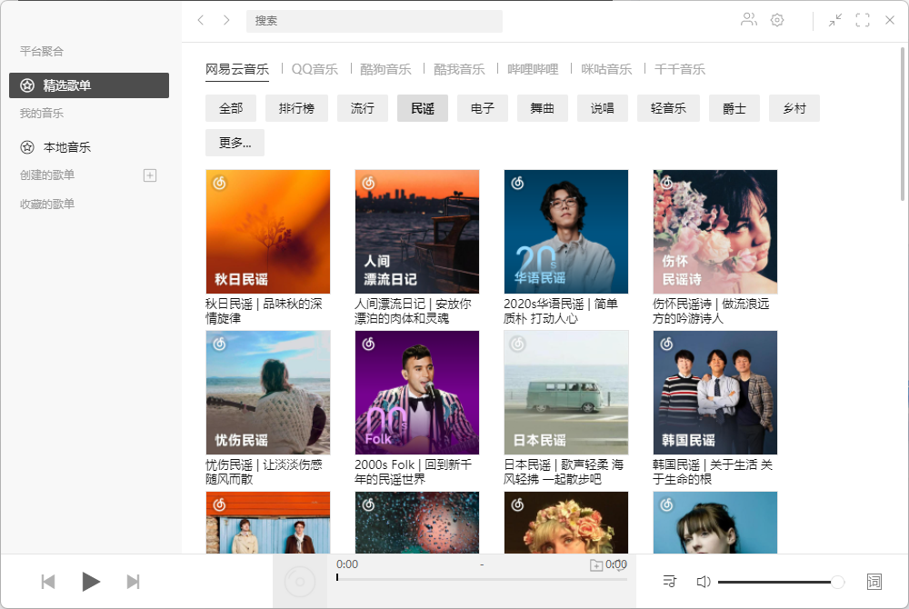

Listen 1可以搜索和播放来自网易云音乐，QQ音乐，酷狗音乐，酷我音乐，Bilibili，咪咕音乐网站的歌曲，让你的曲库更全面。

Listen1不仅支持浏览器扩展， 还有MAC版本， WIndows版本，甚至手机端也有

## 安装

所有安装版都放在这里了。

[listen1音乐播放器](https://pan.quark.cn/s/105a6f47c5d6)

## 插件

### Chrome插件版
- 下载Chrome插件版压缩包，并解压缩
- 打开 Chrome 扩展页面，勾选右上角「开发者模式」
- 选择「加载已解压的扩展程序…」，选择刚刚解压缩的文件夹
- 开始使用

### Windows桌面版
下载Windows压缩包，根据系统选择32位或64位版本

解压缩，运行 Listen1.exe

### Mac桌面版
下载并运行dmg，在打开的安装窗口把Listen 1图标拖动到右侧

点击Listen 1图标运行

## 介绍

一款音乐聚合搜索插件，整合了网易、QQ、酷狗、酷我、虾米五大平台，涵盖了全国几乎所有的曲库。

装上它，用户就可以在这五大平台中快搜跳转搜索关键词，远比切换应用省时省力。

使用Listen 1一般都不会碰到没有版权不能播放音乐，因为Listen 1使用了很多个音乐库，基本上如果QQ没有，网易云应该还有，都没有的话B站也许还有，实在不行翻唱版本（就是音质比较低的）还有一大堆。

打开Listen 1首页即是每个平台的精选歌单推荐，用户可以一键选择收藏或播放。

### Listen 1音乐播放器具有以下功能点：

1. **多平台资源整合**：能搜索和播放来自网易云音乐、QQ音乐、酷狗音乐、酷我音乐、Bilibili、咪咕音乐等多个主流音乐平台的歌曲，让用户的曲库更全面。
2. **数据备份与恢复**：支持歌单数据备份，防止因重装插件或清除缓存导致数据丢失；也能选择备份文件恢复歌单，但恢复时会覆盖现有歌单。
3. **快捷键操作**：软件自带键盘快捷键用于操作歌曲播放，不过不支持自定义更改快捷键。
4. **经典歌单**：拥有几十种不同风格的歌曲分类列表，涵盖华语、欧美、日韩等多种类型。
5. **快速搜索**：可自动更新其他音乐播放站的歌曲，用户能搜索到最新的歌曲进行欣赏。
6. **原始链接查看**：点击播放后，在控制窗口上可点击链接查看歌曲的原始网址，方便用户了解歌曲来源。
7. **我的歌单**：用户可将喜欢的分类列表全部显示到一个项目中保存，随时打开自己中意的歌曲。
8. **播放列表管理**：能控制音乐播放的顺序，自动显示歌词在软件列表中，还可将歌曲从列表中删除。
9. **多平台支持**：支持Windows、macOS、Linux等主流桌面平台，以及安卓、iOS等移动平台，还有Chrome和Firefox等浏览器插件版。
10. **账号登录**：支持网易云音乐、QQ音乐、咪咕音乐等平台登录账号，方便用户同步自己在这些平台上的歌单等信息。
11. **界面简洁**：界面设计简约，操作方便，便于用户快速找到播放列表、搜索歌曲或者查看正在播放的歌曲信息。
12. **语言支持**：支持多种语言，方便不同地区的用户使用。